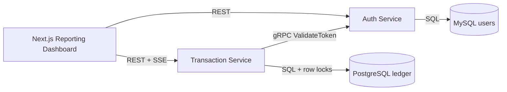

# FinTech Core API

Monorepo contoh untuk platform transaksi keuangan berbasis microservices. Backend ditulis dengan Go menggunakan pola Clean Architecture, PostgreSQL untuk ledger transaksi, MySQL untuk user management, REST API untuk integrasi publik, gRPC untuk komunikasi service-to-service, dan dashboard Next.js untuk pemantauan operasional.

## Arsitektur



## Struktur

- `services/auth`: Auth Service, JWT, RBAC, MySQL, Swagger UI, gRPC token validation.
- `services/transaction`: Transaction Service, deposit/withdraw/transfer, PostgreSQL row locking, REST, SSE, gRPC.
- `frontend/dashboard`: Next.js dashboard untuk account, transaksi, grafik saldo bulanan, dan update real-time.
- `migrations`: migrasi database untuk MySQL dan PostgreSQL dengan `golang-migrate`.
- `proto`: kontrak gRPC untuk dokumentasi antarmuka service.
- `.github/workflows`: pipeline dasar untuk test, build, dan deployment placeholder.

## Jalankan Lokal

1. Salin konfigurasi:

   ```bash
   cp .env.example .env
   ```

2. Jalankan stack:

   ```bash
   docker compose up --build
   ```

3. Akses service:

   - Dashboard: http://localhost:3000
   - Auth Swagger: http://localhost:8080/swagger/
   - Transaction Swagger: http://localhost:8081/swagger/

## Endpoint Utama

Auth Service:

- `POST /api/v1/auth/register`
- `POST /api/v1/auth/login`
- `GET /api/v1/auth/me`
- `GET /api/v1/admin/users/{id}` dengan role `admin`

Transaction Service:

- `POST /api/v1/accounts`
- `GET /api/v1/accounts`
- `POST /api/v1/transactions/deposit`
- `POST /api/v1/transactions/withdraw`
- `POST /api/v1/transactions/transfer`
- `GET /api/v1/transactions?account_id=...`
- `GET /api/v1/reports/monthly-balance?account_id=...`
- `GET /api/v1/events?token=...` untuk Server-Sent Events dashboard

## Catatan Keamanan

- Password disimpan dengan bcrypt.
- Email dan nama lengkap dienkripsi AES-GCM sebelum masuk MySQL.
- Lookup email memakai HMAC-SHA256 deterministic hash agar login tetap bisa dilakukan tanpa menyimpan email plaintext.
- Semua query memakai prepared statements/parameter binding.
- Ledger memakai integer `amount_cents` agar tidak ada error floating point.
- Transfer mengunci account dengan `SELECT ... FOR UPDATE` dalam urutan deterministic untuk mencegah race condition dan mengurangi risiko deadlock.

